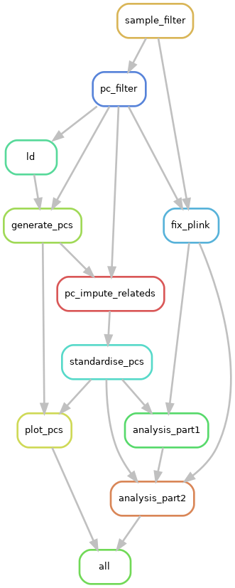

# GWAS pipeline (TEMPLATE)
Basic snakemake workflow for generating and running a GWAS on ALSPAC imputed omics data. 

This is aimed for Direct Users (DUs), but could be adapted for non-DU researchers. There may be additional steps involved here, which are flagged below. 

## 0. Requirements
### Software:
software requiring custom installation:
- Python (3.11)
    - plotly
    - scipy
    python-kaleido
- Snakemake

For running in University of Bristols HPC system, you can use a custom installation of mamba via miniconda, following [ACRC instructions](https://www.acrc.bris.ac.uk/protected/hpc-docs/software/own_software.html). You can use the `environment.yaml` to generate a suitable environment to run the pipeline: 

Generate mamba a copy of the env in `env/smk7.yaml`:
```bash
mamba env create -f env/smk7.yaml
```

Then activate newly created yaml env:
```bash
mamba activate smk7
``` 

The snakemake version 7 was used within this work due to issues of snakemake version 9=< slurm or cluster plugins not appearing to work. This was due to issues of srun not working from a initiated job. I am unclear of exact reasoning, but downgrading fixed these issues following other IEU members suggestions. 

Running using the profile located `profiles/config.yaml` as below allows running on BP to work. This profile instructs the cluster to send the jobs as sbatch, generates default resources and manages the job rules accordingly. Unfortunately, the `cluster-cancel` rule does not work due to a mismatch with the slurm system. If a run fails, you should fully cancel all relevant jobs on slurm yourself via `scancel --me` or `scancel -j <jobid>`.

Run: `snakemake all --profile profiles`

Other software not requiring custom installation on BP. These are automatically loaded in relevant scripts, but check you are able to load them manually: 
- bcftools: `module load bcftools`
- regenie: `module load apps/regenie`
- plink2: `module add apps/plink2`

### Data:
You are required to have an approved research proposal before any data can be released to you. For more information, please visit the [website](https://www.bristol.ac.uk/alspac/researchers/access/). 

This data can either be accessed as a [DU](https://www.bristol.ac.uk/alspac/ieu-info/) or as an external researcher. There are data access costs associated with accessing this data, please see the website and data access policies for details. 

#### Omics data
Access to ALSPAC omics data. This can be as as where the omics data is directly available on current HPC (e.g. BluePebble). Alternatively, if you are not a DU, you will be able to get the data via the standard omics release process outlined in the access documents on the website. 

#### Phenotype data
Built phenotype dataset, either generated by a DU for their own work (potentially using the ALPSAC R package), or generated by the ALSPAC data access team as part of the standard release process for external collaborators.

For your GWAS, you will need phenotype data defined specific to the trait(s) of interest, therefore you should do this separately.  Please ensure your generated phenotype file is compliant with regenies phenotype file format: https://rgcgithub.github.io/regenie/options/#phenotype-file-format.

This pipeline currently expects binary traits in steps 7 for regenie, however you can manually alter the script to not expect binary traits. 

## 1. Pipeline
Pipeline managed using Snakemake file:
- `working/scripts/Snakefile`
This calls all the numbered scripts in general order following rules in the snakefile.

To run this code, snakemake version 7 is required. You can install a version of this via mamba from the `environment.yml` file using mamba/conda.

If you are not a DU, you will receive a freeze of the omics data, which means you would skip step 01 from the pipeline, as all withdrawals of consent will already be removed. You will need to perform a step for ID matching between the phenotype data and the omics data to allow sample filtering in step 2 to work. This is not currently covered in this git repository. Guidance on this process is available: https://www.bristol.ac.uk/media-library/sites/alspac/documents/researchers/data-access/Id_Matching.pdf

### General QC Rules: 

Steps 1, 2 and 3 were merged together to a standardised single rule. This update is due to standard pgen/psam/pvar file formats being used as starting point rather than bgen to save compute and time. These versions were generated from VCF file conversion. 

Rules for running each job found in the [Snakefile](code/Snakefile). All rules currently get ran, but can always be edited out manually if they aren't required. For example, step 4a & 4b for imputing related individuals previously excluded from the PCs, or step 4.5 if the plink2 file formats used contain both FID and IID (gi_topmed_g0m_g1/release/2026-03-09 does not contain these by accident).

Steps ran within this GWAS:
- `01_sample_filter_plink.sh`: 
    - Sample filtering of subset using plink2. Data assumed to already be in plink2 format, which is provided in the DU release version of gi_topmed_g0m_g1. If you are using a different dataset or external release, you will need to perform this conversion. 
    - Subset extracted from phenotype dataset. 
    - *You are responsible for confirming this list has WoCs applied if you are a DU. This will be used for subsetting the dataset, so will use it to apply any WoCs*. 
        - Using `sample_subset_file` defined in the config file. This can be take from the phenotype data, which would require you to manually generate this file. 
- `02_pc_filter.sh`: 
    - Filter the subset dataset for use downstream:
        1. making PCs 
        2. step1 of regenie. 
    - This step also generates a kinship table to filter out related individuals for genration of PCs. Outputs: `data/intermediates/G0m_relatedness.*` which allow for exclusion or inclusion.
        - king_cutoff=*0.125*
    - filter criteria:
        - r2 = *0.95*,
        - maf = *0.05*,
        - geno = *0.1*,
        - mind = *0.1*,
        - hwe = *1e-6*
- `03_ld_prune.sh`: 
    - use plink to generate prune files for snps in LD with one another, currently using plink2 `--indep-pairwise` flag:
        - window size = *100* (edit as required, depends on number of remaining SNPs and use case)
        - step size = *5*
        - threshold = *0.2* 
    - excludes regions of [high LD](https://github.com/meyer-lab-cshl/plinkQC/blob/master/inst/extdata/high-LD-regions-hg38-GRCh38.txt)
- `04_generate_pcs.sh`: 
    - Using plink, perform PCA using the ld_prune.prune.in file generated from `05_ld_prune.sh` to extract  snps not in LD.
    - currently generates number of PCs defined in config file with `total_pcs_calculated`
    - exclude related individuals using `data/intermediates/G0m_relatedness.king.cutoff.in.id` generated from `04_pc_filter.sh` (approx 202 individuals).
- `04a_impute_related_pc.sh`: 
    - This step will use a count file generated by plink2 `--pca allele-wts $pc_number vcols=chrom,ref,alt`, then performs `$allele_weights 2 5 header-read no-mean-imputation variance-standardize` using the allele weights file generated in step 04. 
    - Step can be skipped if you prefer. Manually editing the snakefile if this is done to allow step to be skipped.
- `04b_pc_formatting.py`: 
    - Reformatting step required align the score with eigenvec files (https://www.cog-genomics.org/plink/2.0/score). 
    - Divides scores by eigenvals sqrt to scale to PCs. This aims to keep the 124 previously dropped individuals from the dataset.
    - The outliers are also excluded  here (if outlier param is true). This uses mahanalobis distance to identify extreme outliers in the samples for exclusion.
    - Output ready for use in regenie. 
- `04c_PC_plot_and_variance.py`: 
    - Generates a PC plot for number of PCs planned to be used in the regenie steps. 
    - Can be useful for seeing if there is structure introduced by the PCs.
    - Generally found PCs explain low variance as it is EUR ancestry group, therefore PCs do not account for this variation. 
- `04.5_fix_plink.sh`: 
    - Optional step. Reformatting step required to correct current plink2 format from only IID to FID and IID. This is present due to VCF conversion to plink2 format used when generating the datasets.
    - Currently does not check for if there is IID and FID present, instead only does the switch. This is an improvement which can be added in future. 
- `05_regenie.p1.sh`: 
    - Starts the GWAS analysis using regenie. Required to be split into 2 steps, following to regenie documentation. 
    - Step 1 performs whole-genome regression to generate a LOCO ridge regression prediction model. 
    - Uses the input of the PC filtering (without excluding the individuals) as this step requires a reduced size of snps with high certainty. Outputs .loco files in `data/intermediates/regenie_step1`. Options used currently as default:
        - bsize = *2000*,
        - covarFile = PCs generated by step `04_generate_ld.sh`,
        - `bt` to indicate binary traits
- `06_regenie.p2.sh`: 
    - Finish GWAS analysis using regenie. Performs single-variant association testing based on the prediction models from step 1. Uses linear regression. Outputs `egg_{pheno}.regenie` files for each pheno column in phenotype file. Options used:
        - bsize = *4000*
        - covarFile = PCs generated by step `04generate_ld.sh`,
        - `bt` indicating binary traits
        - `--firth` to use firth regression
        - pThresh = *0.05* - this should be the standard but can be altered via Snakefile easily. 
        - pred = output `data/intermediates/regenie_step1/egg_pred.list` from step 1 of regenie

Diagram of pipeline: <br>


## 2. Output/results
Summary statistics are outputted from regenie step 2. No further QC or filtering has been conducted on the regenie output. 

Result files will be produced per phenotype included. 

Result columns: 
CHROM GENPOS ID ALLELE0 ALLELE1 A1FREQ N TEST BETA SE CHISQ LOG10P EXTRA
